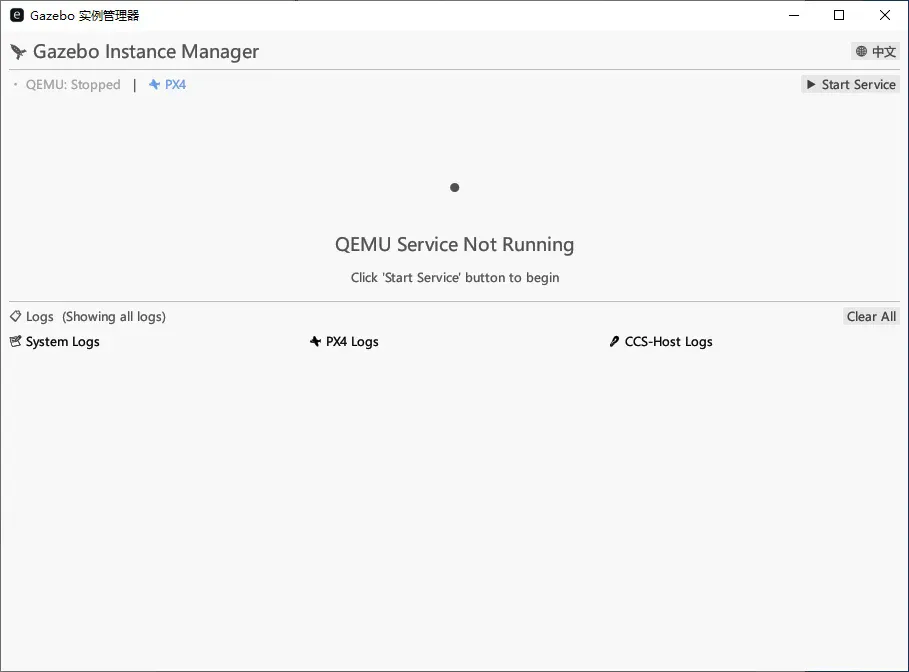
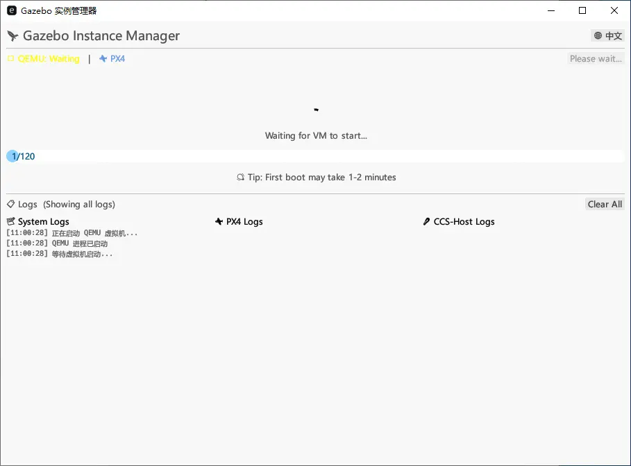
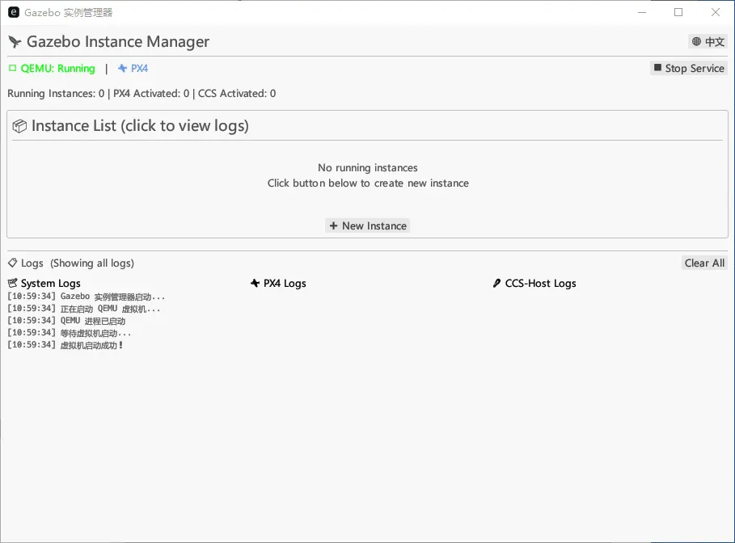
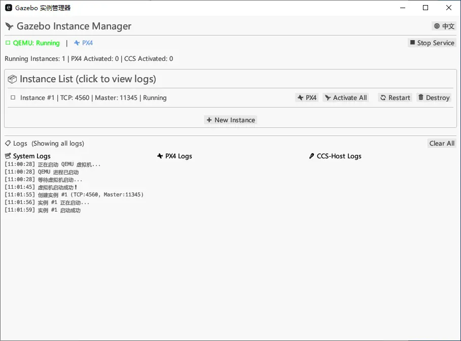
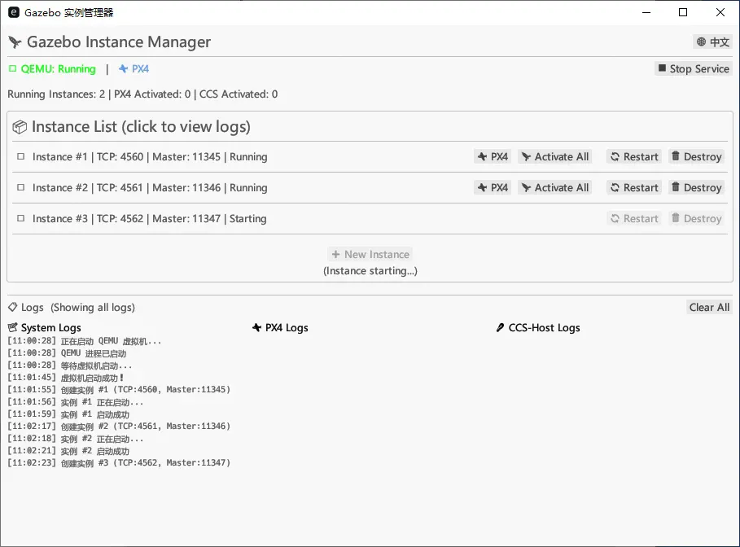
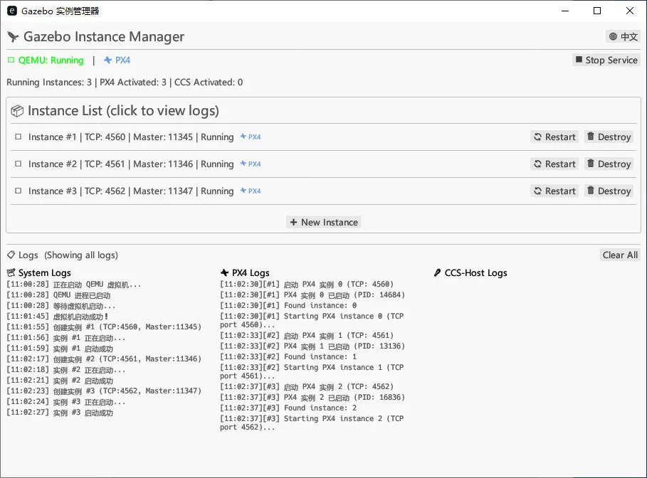
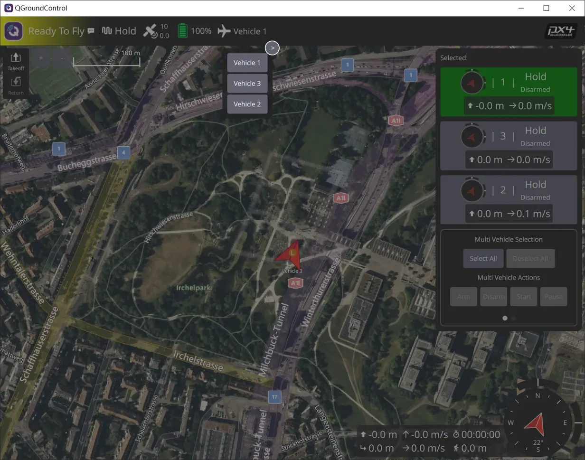
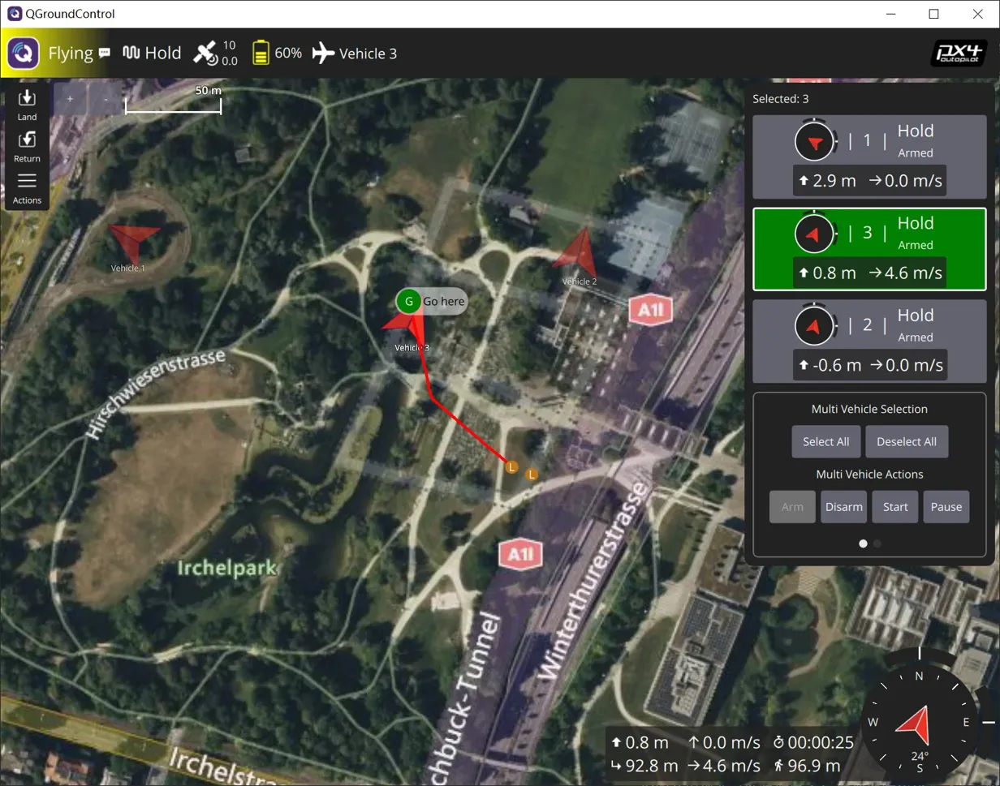

# GazeboPortable

中文 | [English](README.md)

一个便携式的 Gazebo + PX4 + QEMU 多无人机仿真环境，支持在 Windows 平台快速部署和运行。

## ✨ 项目特性

- 🚀 **一键启动**：无需复杂配置，开箱即用的仿真环境
- 🎮 **多实例管理**：支持同时运行多个无人机实例
- 🖥️ **完整集成**：集成 Gazebo、PX4、QEMU 和 QGroundControl
- 📦 **便携设计**：所有依赖打包，无需安装系统级组件
- 🔧 **可视化管理**：友好的 GUI 界面管理实例和服务

## 🖼️ 功能展示

### 实例管理器

#### 服务启动
启动 QEMU 虚拟机服务，为仿真环境提供运行基础。



#### 虚拟机启动
首次启动可能需要 1-2 分钟，请耐心等待。



#### 创建实例
QEMU 服务运行后，可以创建和管理多个 Gazebo 实例。



#### 单实例运行
每个实例独立运行，拥有独立的 TCP 端口和 MAVLink 连接。



#### 多实例协同
支持同时运行多个实例，模拟多机协同场景。



#### PX4 激活
实例启动后可以激活 PX4 自动驾驶仪固件。



### QGroundControl 集成

#### 多机地面站
在 QGroundControl 中同时监控和控制多架无人机。



#### 任务执行
支持航点规划、任务上传和实时飞行监控。



## 🚀 快速开始

### 前置要求

- Windows 10/11 (64-bit)
- 至少 8GB RAM
- 支持虚拟化的 CPU

### 克隆仓库

```bash
git clone https://github.com/coasho/GazeboPx4Qemu.git
cd GazeboPx4Qemu
```

> **注意**: 本仓库使用 Git LFS 管理大文件，克隆前请确保已安装 [Git LFS](https://git-lfs.github.com/)

### 启动步骤

1. **启动实例管理器**
   ```bash
   gazebo-win-desk.exe
   ```

2. **启动 QEMU 服务**
   - 点击右上角 "Start Service" 按钮
   - 等待虚拟机启动（首次启动需要 1-2 分钟）

3. **创建实例**
   - 点击 "+ New Instance" 创建新的 Gazebo 实例
   - 等待实例启动完成

4. **激活 PX4**
   - 点击实例旁边的 "⚡ PX4" 按钮激活自动驾驶仪
   - 实例将自动连接到 PX4 固件

5. **连接 QGroundControl**
   - 启动 QGroundControl
   - 软件会自动发现并连接到运行中的实例

## 📋 实例信息

每个实例包含以下信息：

- **TCP 端口**: Gazebo 通信端口 (如: 4560, 4561, 4562...)
- **Master 端口**: ROS Master 端口 (如: 11345, 11346, 11347...)
- **状态**: Running / Starting / Stopped

## 🔧 端口配置

默认端口分配：

| 实例 | TCP 端口 | Master 端口 | MAVLink 端口 |
|------|----------|-------------|--------------|
| #1   | 4560     | 11345       | 14550        |
| #2   | 4561     | 11346       | 14551        |
| #3   | 4562     | 11347       | 14552        |

## 📁 目录结构

```
GazeboPx4Qemu/
├── vm/
│   └── gazebo.qcow2          # QEMU 虚拟机镜像 (Git LFS)
├── PX4-standalone/
│   └── home/Firmware/
│       └── bin/px4.exe       # PX4 固件
├── gazebo-win-desk.exe  # 实例管理器
└── README.md
```

## ⚙️ 系统日志

实例管理器提供三种日志视图：

- **System Logs**: 系统级日志，显示 QEMU 和管理器状态
- **PX4 Logs**: PX4 固件运行日志
- **CCS-Host Logs**: 自定义控制服务日志

## 🐛 常见问题

### QEMU 服务无法启动

- 确保已启用 Windows 虚拟化功能 (Hyper-V)
- 检查防火墙是否阻止了 QEMU 进程
- 尝试以管理员身份运行

### 实例创建失败

- 确认 QEMU 服务已正常运行
- 检查端口是否被占用
- 查看 System Logs 获取详细错误信息

### QGroundControl 无法连接

- 确认实例已激活 PX4
- 检查 MAVLink 端口是否被占用
- 在 QGC 中手动添加 UDP 连接: `localhost:14550`

## 🤝 贡献

欢迎提交 Issue 和 Pull Request！

## 📄 许可证

本项目采用 MIT 许可证。详见 [LICENSE](LICENSE) 文件。

## 🔗 相关链接

- [PX4 Autopilot](https://px4.io/)
- [Gazebo Simulator](http://gazebosim.org/)
- [QGroundControl](http://qgroundcontrol.com/)
- [QEMU](https://www.qemu.org/)

## 📧 联系方式

如有问题或建议，请通过 GitHub Issues 联系我们。

---

⭐ 如果这个项目对你有帮助，欢迎 Star！
